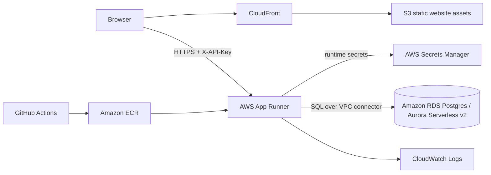

# Architecture

## Diagram

## Decisions

- **Backend runtime:** AWS App Runner runs the API container from ECR. This keeps deployment simple while preserving automatic scaling and HTTPS termination.
- **Data layer:** Postgres is accessed through SQLAlchemy repository classes. Schema changes are versioned through Alembic migrations.
- **Code structure:** controllers/routes handle HTTP only; service owns use-case logic; repository owns SQL persistence. Pydantic DTOs are separate from SQLAlchemy persistence models and domain enums.
- **Authentication:** MVP uses `X-API-Key`. The API key is injected through environment variables and should be sourced from Secrets Manager in AWS.
- **Frontend:** static client is deployable as S3 assets behind CloudFront. It calls the API over HTTPS and sends `X-API-Key`.
- **Observability:** middleware creates/propagates `X-Request-ID` and writes structured request logs to stdout, which App Runner ships to CloudWatch Logs.
- **Cloud configuration:** no hardcoded runtime configuration. Database URL, API key, CORS origins and runtime mode are environment variables.

## Main request flow

1. Browser loads static assets from CloudFront/S3.
2. Web client calls App Runner API over HTTPS.
3. API validates `X-API-Key` and request DTO.
4. Route delegates to service.
5. Service delegates persistence to repository.
6. Repository queries Postgres.
7. Middleware logs request id, method, path, status and latency.
